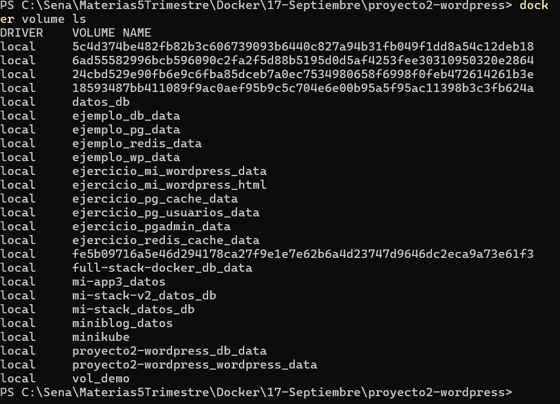

# Proyecto 2 — WordPress persistente con Docker Compose

Sitio WordPress con base de datos MySQL orquestado con Docker Compose. El
entorno se levanta con un solo comando, los servicios se comunican por una red
personalizada y los datos persisten al recrear los contenedores.

**Autora:** Mariana Uribe Muñoz
**Programa:** Análisis y Desarrollo de Software (ADSO) — SENA
**Ficha:** 3229209
**Instructor:** Richard Betancur

---

## Requisitos

- Docker Desktop instalado y en ejecución
- Git

No se requiere instalar WordPress, PHP ni MySQL en la máquina anfitriona: ambos
servicios se ejecutan desde imágenes oficiales.

---

## Estructura del proyecto

El archivo `.env` no se incluye en el repositorio por contener credenciales.

---

## Configuración

Antes de levantar el entorno, crear el archivo `.env` a partir de la plantilla:

```bash
cp .env.example .env
```

En Windows (PowerShell):

```powershell
Copy-Item .env.example .env
```

Y completar los valores:

| Variable | Descripción |
|---|---|
| `MYSQL_ROOT_PASSWORD` | Contraseña del usuario root de MySQL |
| `MYSQL_DATABASE` | Nombre de la base de datos de WordPress |
| `MYSQL_USER` | Usuario de la base de datos |
| `MYSQL_PASSWORD` | Contraseña del usuario |
| `WORDPRESS_PORT` | Puerto del host donde se publica el sitio |

---

## Ejecución

### Levantar el entorno

```bash
docker compose up -d
```

El sitio queda disponible en `http://localhost:8080`.

En el primer arranque, WordPress muestra el asistente de instalación. Una vez
completado, la configuración persiste en los volúmenes.

### Verificar el estado

```bash
docker compose ps
docker volume ls
docker compose logs -f
```

### Detener el entorno

```bash
docker compose down
```

Este comando elimina contenedores y red, pero **conserva los volúmenes** y por
lo tanto todos los datos.

---

## Servicios

| Servicio | Imagen | Puerto | Función |
|---|---|---|---|
| `db` | `mysql:8.0` | interno | Base de datos del sitio |
| `wordpress` | `wordpress:latest` | 8080 → 80 | Aplicación web |

### Volúmenes

| Volumen | Punto de montaje | Contenido |
|---|---|---|
| `db_data` | `/var/lib/mysql` | Base de datos completa |
| `wordpress_data` | `/var/www/html` | Archivos subidos, temas y plugins |

### Red

Los servicios se comunican a través de la red personalizada `wordpress_net`
(driver `bridge`), que permite la resolución por nombre de servicio.

---

## Prueba de persistencia

Procedimiento aplicado para demostrar que los datos sobreviven a la
recreación de los contenedores:

1. Levantar el entorno e instalar WordPress.
2. Publicar una entrada de prueba y verificarla en el sitio público.
3. Ejecutar `docker compose down` y comprobar con `docker compose ps` que no
   queda ningún contenedor en ejecución.
4. Ejecutar `docker compose up -d` nuevamente.
5. Acceder a `http://localhost:8080` y verificar que la entrada sigue
   publicada, sin necesidad de reinstalar WordPress ni volver a iniciar sesión.

### Antes de `docker compose down`


### Después de `docker compose up -d`


### Volúmenes creados



---

## Preguntas

**¿Qué comando eliminaría también los datos y por qué debe usarse con cuidado?**

`docker compose down -v`. El flag `-v` elimina los volúmenes nombrados junto
con los contenedores y la red. Al borrar `db_data` se pierde la base de datos
completa, y al borrar `wordpress_data` se pierden los archivos subidos, temas
y plugins. Sería necesario reinstalar WordPress desde cero. Debe usarse solo
cuando se quiere reiniciar el entorno de forma intencional.

**¿Por qué WordPress se conecta al host `db` y no a una dirección IP?**

Porque ambos servicios comparten la red personalizada `wordpress_net`, en la
que Docker provee resolución DNS interna por nombre de servicio. `db` se
traduce automáticamente a la IP del contenedor de MySQL. Usar una IP fija no
sería viable: las direcciones se reasignan cada vez que los contenedores se
recrean, mientras que el nombre del servicio permanece estable.

**¿Qué aporta el healthcheck frente a un `depends_on` simple?**

Un `depends_on` simple solo garantiza el orden de arranque: espera a que el
contenedor de la base de datos inicie, no a que MySQL esté listo para aceptar
conexiones. MySQL requiere varios segundos de inicialización, por lo que
WordPress intentaría conectarse a un servicio que todavía no responde. El
healthcheck ejecuta `mysqladmin ping` de forma periódica y, combinado con
`depends_on: condition:service_healthy`, hace que WordPress arranque solo
cuando la base de datos está efectivamente operativa. En la salida de
`docker compose up -d` se observa este comportamiento: el contenedor `db`
alcanza el estado `Healthy` en 11 segundos y `wordpress` arranca después.

---

## Decisiones técnicas

- **Volúmenes nombrados en lugar de bind mounts:** Docker gestiona su
  ubicación y ciclo de vida, lo que los hace portables entre equipos y
  sistemas operativos.
- **Credenciales externalizadas a `.env`:** el archivo se excluye del
  repositorio mediante `.gitignore` y se documenta con `.env.example`, de modo
  que el `docker-compose.yml` puede versionarse sin exponer contraseñas.
- **Puerto 8080 en el host:** evita conflictos con otros servicios que puedan
  estar usando el puerto 80.
- **`restart: unless-stopped`:** los servicios se reinician automáticamente
  tras un reinicio del equipo, salvo que se hayan detenido de forma explícita.
- **Versión fija `mysql:8.0`:** garantiza que el entorno se reproduzca igual
  en cualquier equipo, a diferencia de un tag flotante.